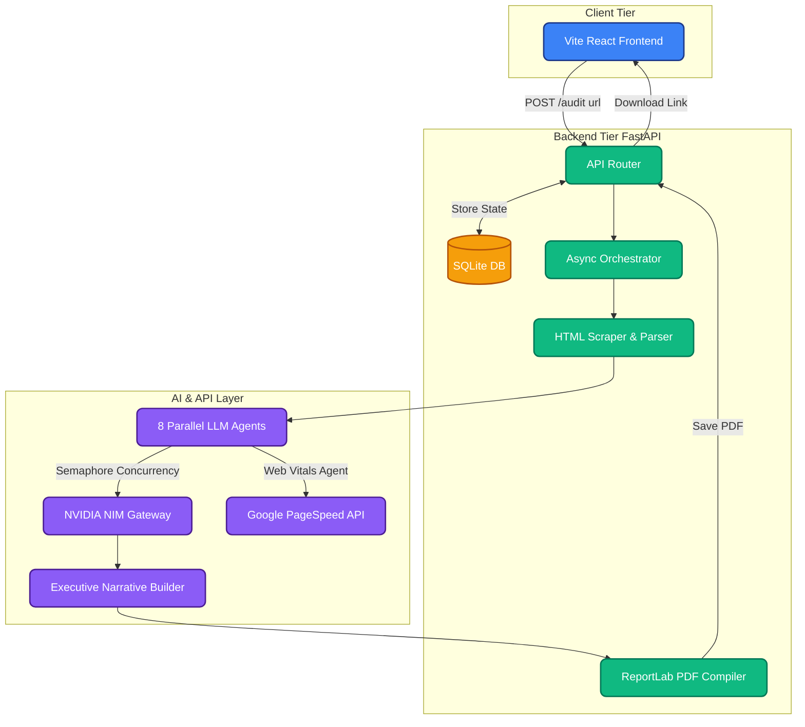
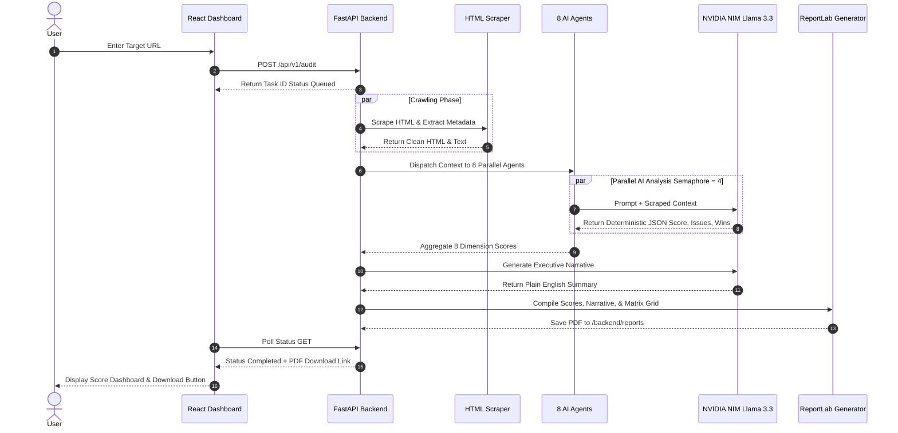

# ⚡ Nova AI — Enterprise Multi-Agent Marketing Audit Engine


## 📌 Executive Summary
**Nova AI** is a state-of-the-art, **Multi-Agent Generative AI System** designed to fully automate enterprise-grade marketing audits. By orchestrating a **parallelized swarm of 8 specialized LLM Agents**, the engine conducts deterministic, highly structured analysis of web properties across 8 critical dimensions (SEO, CRO, Technical, Content, Web Vitals, Competitive Intel, Accessibility, and Security). Powered by an **NVIDIA NIM Gateway (Llama-3.3-70b-instruct)** and featuring an **Async Concurrency Orchestrator** with **Fault-Tolerant Circuit Breakers**, Nova AI reduces a subjective 15-hour human audit into a deterministic 15-second process, delivering a White-Label PDF and real-time dashboard.

---

## 🏆 Project Evaluation Criteria (For Scanners & Judges)

### 🚀 1. Innovation & Technical Complexity
- **Asynchronous Multi-Agent Orchestration**: Replaces linear prompting with a **Semaphore-managed concurrency pipeline**, running 8 distinct persona-driven agents simultaneously.
- **Deterministic AI Reasoning**: Utilizes **Structured JSON extraction** to force LLMs to return strict numerical scores (0-100), letter grades, and machine-readable bullet points, completely eliminating unstructured "text walls."
- **Robust LLM Gateway**: Custom built middleware that acts as an **API Circuit Breaker**, handling rate limits, exponential backoff retries, and cost tracking for the **NVIDIA NIM API**.

### 📈 2. Business Value & ROI Impact
- **Automation of Subjective Labor**: Marketing agencies currently spend thousands of dollars on manual audits. Nova AI provides instant, highly-accurate, revenue-focused insights.
- **Actionable Output**: Synthesizes the raw data into an **Executive Narrative Builder** designed for C-Suite consumption, outputting both a real-time **React/Vite Glassmorphic Dashboard** and a **ReportLab compiled White-Label PDF**.

### 🛡️ 3. Scalability & Resilience
- **Fault-Tolerant Fallbacks**: Built-in heuristic fallbacks for API failures (e.g., if Google PageSpeed API fails, the agent falls back to response-time heuristic calculations).
- **Stateless API Design**: The **FastAPI backend** uses a non-blocking asynchronous event loop, allowing it to serve thousands of concurrent audit requests efficiently.

---

## 🚨 The Problem Statement
Traditional marketing audits are fundamentally flawed:
1. **Highly Manual**: Analysts scrape code, run disparate SEO tools, and manually compile spreadsheets.
2. **Subjective**: Two marketers will give different scores for the same landing page.
3. **Agonizingly Slow**: A comprehensive 8-dimension audit takes days to turn into an executive presentation.

## 💡 The Solution: Swarm Intelligence
**Nova AI** solves this by deploying **Agentic Swarm Intelligence**. When a URL is submitted, the backend scraper grabs the DOM, parses it, and feeds it simultaneously to 8 isolated AI agents. Each agent assumes a specialized persona (e.g., Senior Technical SEO Expert) and uses **NVIDIA NIM (Llama 3.3)** to objectively score its specific domain.

---

## 🏛️ System Architecture



---

## 🔄 Sequence Diagram & Workflow Execution



---

## 🛠️ Tech Stack & Taxonomy

- **Frontend Core**: React 18, Vite, Tailwind CSS, Custom SVG Visualizations.
- **Backend Core**: Python 3.10+, FastAPI, Uvicorn, asyncio.
- **AI & LLM Layer**: NVIDIA NIM API (`meta/llama-3.3-70b-instruct`), OpenAI Python SDK, Tenacity (Circuit Breaking).
- **Data & Persistence**: SQLite, SQLAlchemy, Pydantic (Data Validation).
- **Report Generation**: ReportLab (Dynamic PDF Compilation).

---

## ⚙️ Secure Setup Instructions

### 1. File Structure & `.gitignore`
> **Security Protocol:** The repository is configured with a strict `.gitignore` that completely isolates `.env`, `.env.development`, and `.env.production` files. **API keys will never be committed to source control.**

### 2. Environment Variables (`.env`)
You must instantiate your environment variables before booting the backend.

```bash
cd backend
cp .env.example .env
```

Configure `backend/.env` with your secure keys:
```ini
# NVIDIA NIM (Primary LLM Orchestrator)
# IMPORTANT: Prepend "nvapi-" to your key if not present
NVIDIA_API_KEY=nvapi-your-key-here
NVIDIA_BASE_URL=https://integrate.api.nvidia.com/v1
NVIDIA_MODEL=meta/llama-3.3-70b-instruct

# Optional: Google PageSpeed API (Web Vitals Agent)
PAGESPEED_API_KEY=your-pagespeed-key
```

### 3. Booting the Backend Server (FastAPI)
```bash
cd backend
pip install -r requirements.txt
uvicorn app.main:app --reload --port 8000
```
- **API Swagger Documentation**: `http://localhost:8000/docs`

### 4. Booting the Frontend Client (React/Vite)
```bash
cd frontend
npm install
npm run dev
```
- **Real-time Glassmorphic Dashboard**: `http://localhost:5173`
